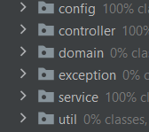
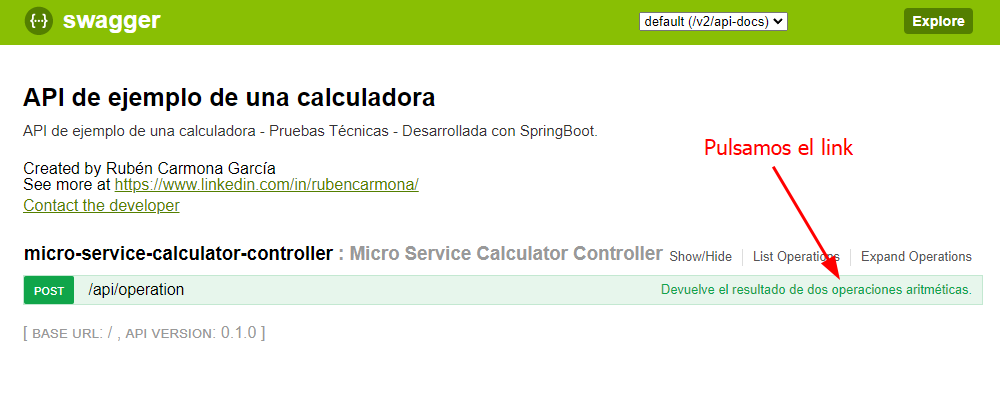
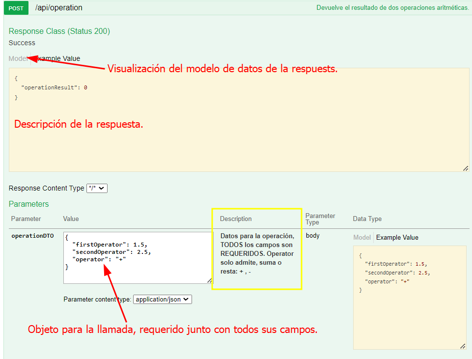
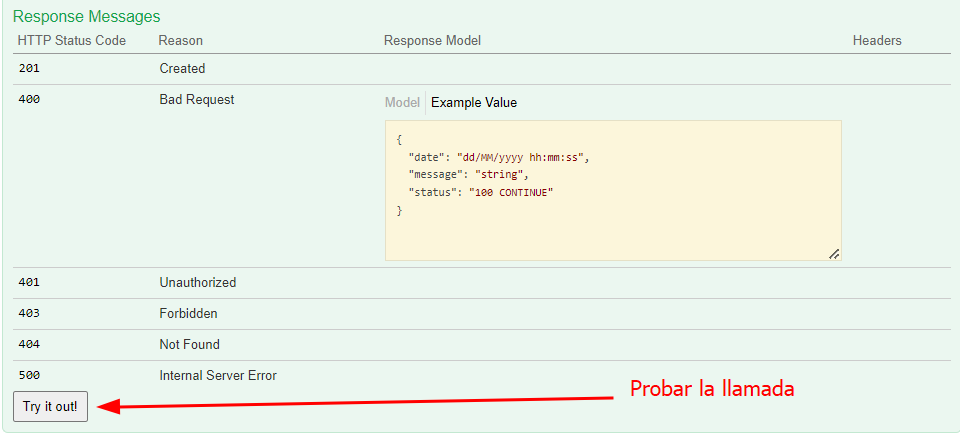

# MicroserviceCalculator

Autor:
- Rubén Carmona García
Fecha: 2022-07-24 
- https://www.linkedin.com/in/rubencarmona/

## Introducción

Microservicio que simula el funcionamiento de una calculadora.
Recibe dos parámetros y un operador aritmético.
Solamente está implementado la suma y resta, dejando la posibilidad de añadir más 
operadores y extender las operaciones a realizar.

Nos hemos vasado en la estructura típica por capas, separando controladores, servicios, etc...

## Tecnologías usadas

- Java 17
- SpringBoot 2.7.2
- SpringWeb 5.3.20
- Lombok 1.18.24
- Swagger 2.7.0
- Git 2.36.0
- Maven 3.8.0

Como ide IntelliJ IDEA 2022.1.4.

## Commits

Explicación de los commits realizados.

- ad0fcb5fb65eb1b943ecd4430e1a349738f749f8

Añadimos las dependencias necesarias, estructura de proyecto y se realiza el primer test del contexto de la aplicación.

- f5a2e3ae82f6d1d5847f83125ee0f6fac491d498

Creación de las clases de dominio y sus DTOs.
En la propuesta de solución se ha tenido en cuenta no devolver las entidades directamente.

Clase de utilidad para pasar cualquier objeto al formato JSON correcto.

- 5d859d2262f0a5de0da8d8d804a5adcc1415bd1b

Creamos las clases del controlador, servicio y realizamos los primeros test de los mismos.
No realizamos correctamente el test del servicio, más adelante y haciendo más test se soluciona.

- 00db9e4191829cec12adf7d3eeb208ead00e30ca

Añadimos la clase de configuración del traceador de los datos, iniciamos lógica de negocio.

- da49fd1ec59e0c6077c490d18cbd377c2c742ba4

Comentarios javadoc con explicación del código.

- 452d5ba0c3ed9e38001b68ea8baee60b6a9e6754

En un principio el mapeo de los objetos a dto y viceversa se iba a realizar con mapStruct, por
motivos de incompatibilidad en las versions usadas en el proyecto se ha descartado por el uso de 
Lombok Builder, es una simulación de no devolver los objetos directamente.
 
- 21f4a8c16cdc9a10b564504847b0aad61e7ff003

Subimos el coverage y modificamos el código de la lógica para validar más datos, haciendo test lo hemos visto necesario.

- a724f732eb6a0ef440bcbaf670d8292f7c3ad7ff

Añadimos la documentación para el frontal del microservicio con las dependencias de Swagger2 y Springfox.

Una vez inicializado el proyecto o ejecutado el jar, la url de acceso es: http://localhost:8080/swagger-ui.htm

En la UI de Swageer está toda la información para poder user el microservicio.

## Resources

Dentro de esta carpeta se han incluido unos archivos jar que deberán de ser instalados para el uso del traceador.

## Dentro del Microservicio

Mediante la interfaz web de Swagger se podrá probar y lanzar llamadas al microservicio.

Una vez desplegados tendremos todos los datos necesarios para poder probar y realizar llamadas.

Algunos estados de respuesta son incluidos por defecto. El más relevante es el de BAD_REQUIEST al
ser esté creado por nosotros con los datos que realmente queremos devolver, se visualiza el objeto
que recibiremos.

| Campos | Información                                                      |
|----|------------------------------------------------------------------|
| `operationResult`| Resultado de la operación, BigDecimal. Recibimos en la respuesta. |
| `firstOperator`| Primer operador, BigDecimal.                                     |
| `secondOperator`| Segimdp operador, BigDecimal.                                    |
| `operator`| Operador, String, valores posibles: `+` y `- `                   |
| | Solamente está implementado la suma y la resta.                  |

### Comando de maven útiles

- $ mvn compile – compila el proyecto y deja el resultado en target/classes
- $ mvn test – compila los test y los ejecuta
- $ mvn install – guarda el proyecto en el repositorio
- $ mvn clean – borra el directorio de salida (target)

Empaquetado de la aplicación.

- $ mvn package – empaqueta el proyecto y lo dejará en taget/microservice-calculator-0.1.0-SNAPSHOT.jar

### Documentación de referencia.

* [Official Apache Maven documentation](https://maven.apache.org/guides/index.html)
* [Spring Boot Maven Plugin Reference Guide](https://docs.spring.io/spring-boot/docs/2.7.2/maven-plugin/reference/html/)
* [Create an OCI image](https://docs.spring.io/spring-boot/docs/2.7.2/maven-plugin/reference/html/#build-image)
* [Spring Web](https://docs.spring.io/spring-boot/docs/2.7.2/reference/htmlsingle/#web)

### Guias

* [Building a RESTful Web Service](https://spring.io/guides/gs/rest-service/)
* [Serving Web Content with Spring MVC](https://spring.io/guides/gs/serving-web-content/)
* [Building REST services with Spring](https://spring.io/guides/tutorials/rest/)
